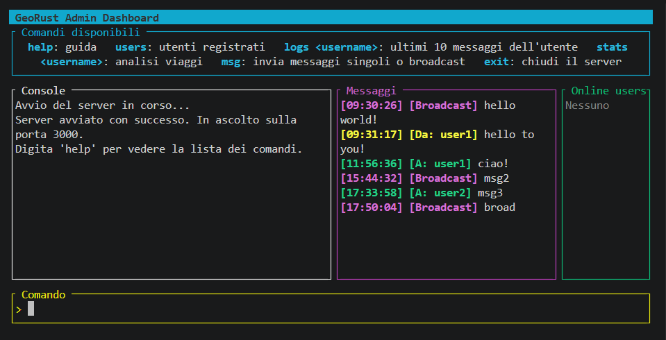
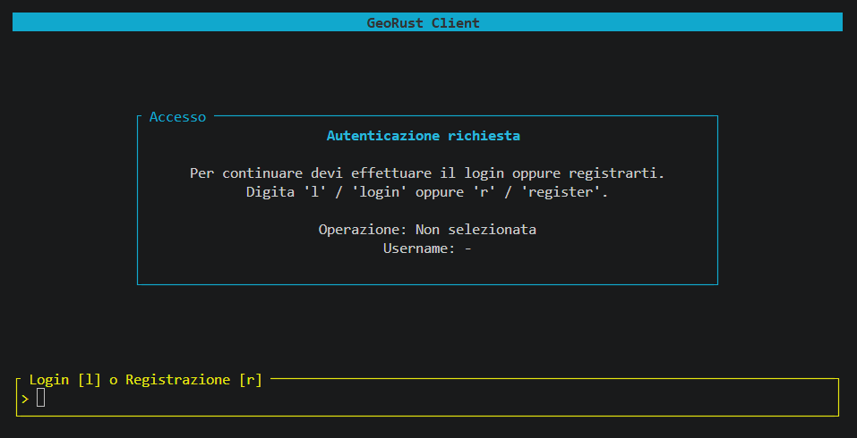

# GeoRust



## Description
GeoRust is a client/server application developed in Rust to simulate the geolocation of a fleet of vehicles. 
Each client represents a user who can register, authenticate, follow a route described by a CSV file, and communicate with the server. 
The server receives positions, detects moving and idle periods, saves completed routes, and allows querying aggregate statistics.

## Key Features

- User registration and authentication;
- Periodic position updates via WebSockets;
- Repeatable simulation of routes loaded from CSV files;
- Detection of moving and idle states;
- Calculation of distance, duration, and average speed of routes;
- Daily, weekly, and monthly statistics;
- Direct and broadcast messages between server and client;
- Deferred delivery of direct messages to offline users;
- Text-based User Interfaces (TUI) for both client and server;
- Event logging and periodic monitoring of the server's CPU usage.

## Interfaces

### Client



### Server


## Project Structure

GeoRust is organized as a Cargo workspace consisting of three crates:

```text
GeoRust/
├── client/    application used by the users
├── server/    connection, data, and statistics management
├── common/    shared types and protocol messages
├── data/      CSV routes used by the simulation
└── docs/      project manuals and documentation
```

The client and server use Tokio for asynchronous tasks and communicate via HTTP requests and a WebSocket connection.<br>
The server is built with Axum and saves users, routes, and messages in an SQLite database using SQLx.<br> 
The text user interfaces (TUIs) are built with Ratatui and Crossterm.<br>

## Requirements

To compile and run the project, the following are required:
- Rust and Cargo with 2024 edition support;
- A Crossterm-compatible terminal;
- TCP port 3000 available on the machine running the server.

The project has been tested on Windows and Linux.<br>
SQLite is used locally and does not require the installation of a separate database server.

## Quick start

From the project's root folder, open a terminal and start the server:

```bash
cd server
cargo run --release
```

Then, open a second terminal and start the client:

```bash
cd client
cargo run --release
```

The server must be running before registering or logging in from the client. Multiple client instances can be started in separate terminals.

## Basic usage

Upon startup, the client allows registering a new user by pressing `r` or logging in with an existing account by pressing `l`.<br>
After authentication, the following commands are available:

| Command | Description |
|---|---|
| `help` | Shows the command guide. |
| `start` | Allows selecting a CSV route and starts the simulation. |
| `msg <testo>` | Sends a message to the server. |
| `exit` | Closes the client. |

The server console provides these commands:

| Command | Description |
|---|---|
| `help` | Shows the command guide. |
| `users` | Lists registered users. |
| `logs <username>` | Shows up to 10 messages associated with the user. |
| `stats <username>` | Views the user's route statistics. |
| `msg` | Starts the guided prompt to send a direct or broadcast message. |
| `exit` | Stops the server. |

For a complete description of the interfaces and available operations, refer to the [user manual](./docs/manuale_utente.md).

## Available Routes

The files in the [`data`](./data/) folder contain the coordinates and logical times used by the simulation.<br> 
Each new position is associated with a logical interval of 30 seconds.

| Route | Points | Duration (min) | Distance | Movement (s) | Pause (s) | Average velocity |
|---|---:|:---:|---:|:---:|:---:|---:|
| [Torino–Asti](./data/Torino-Asti.csv) | 96 | 47,5 | 46,54 km | 2.850 | 0 | 58,79 km/h |
| [Vercelli–Novara](./data/Vercelli-Novara.csv) | 33 | 16 | 20,86 km | 780 | 180 | 96,28 km/h |
| [Torino–Cuneo](./data/Torino-Cuneo.csv) | 111 | 55 | 81,38 km | 3.090 | 210 | 94,81 km/h |
| [Alessandria–Vercelli](./data/Alessandria-Vercelli.csv) | 61 | 30 | 48,87 km | 1.800 | 0 | 97,74 km/h |
| [Torino–Milano](./data/Torino-Milano.csv) | 172 | 85,5 | 130,11 km | 4.710 | 420 | 99,45 km/h |
| [Novara–Milano](./data/Novara-Milano.csv) | 62 | 30,5 | 44,39 km | 1.650 | 180 | 96,85 km/h |
| [Torino–Biella](./data/Torino-Biella.csv) | 95 | 47 | 73,60 km | 2.640 | 180 | 100,36 km/h |

## Documentation

- [User manual](./docs/manuale_utente.md): installation, startup, and usage of the application.
- [Developer manual](./docs/manuale_progettista.md): architecture, implementation choices, and project analysis.
- [Linux Tests](./docs/tests_on_Linux.md): checks performed in a Linux environment.
