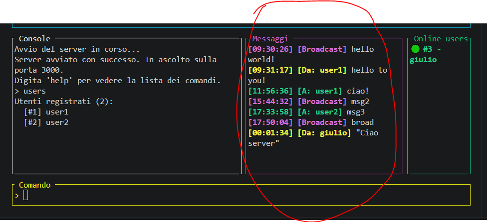
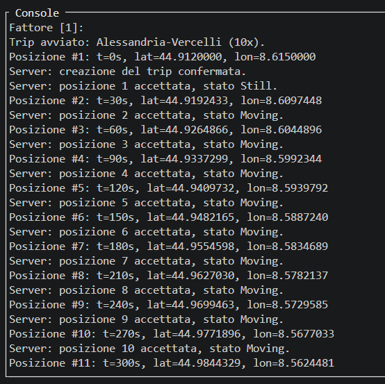
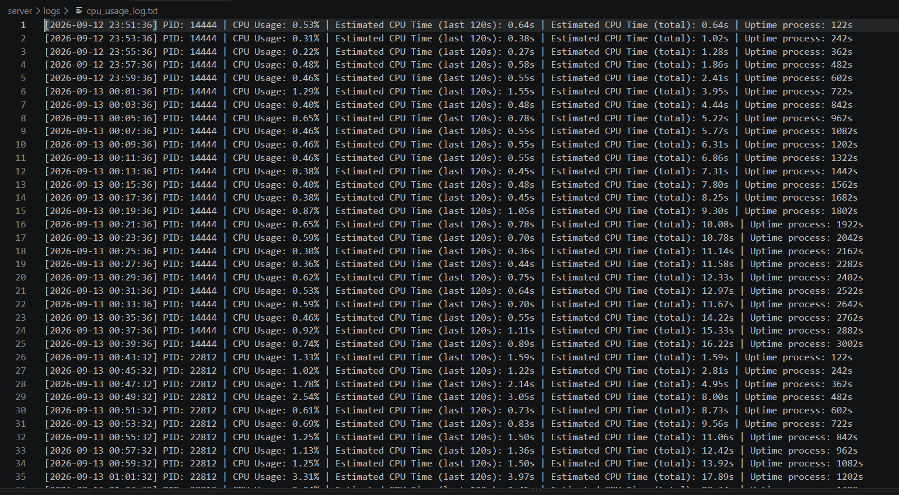

# Manuale Utente

Il progetto si può installare estraendo lo zip ed entrando dentro le cartelle "client" e "server" con il comando lanciato dalla root folder:

```
cd client
```

```
cd server
```

"common" è una libreria con strutture e tratti finalizzate all'inter-comunicabilità tra server e client, ma non serve gestirla da utente.

Dopodichè si può buildare ciascuno dei due progetti usando

```
cargo build
```

e poi lanciarlo usando:

```
cargo run
```

Non possono essere buildati contemporaneamente in quanto usano entrambi la lib "common" in fase di build, ma una volta finita la build possono essere usati contemporaneamente.

È necessario lanciare un'istanza del server e un numero di istanze a piacere del client.

## Server

Dopo il lancio di "cargo run", si accede a un'interfaccia:


Da qui è possibile usare i seguenti comandi:

- **help**: riporta la guida con gli stessi comandi qui riportati
- **users**: permette di ottenere una lista con tutti gli utenti registrati
- **logs [username]**: permette di vedere gli ultimi 10 messaggi inviati
- **stats [username]**: permette di ricevere informazioni e statistiche su un utente. Una volta inviato, verrà chiesto quale statistica visualizzare: distanza, tempo in movimento, durata di movimento, durata da fermo e velocità media
- **msg**: permette di inviare messaggi ai client. Una volta inserito il comando, chiede che tipo di messaggio inviare (broadcast o diretto), se diretto il nome dell'utente a cui inviarlo e poi chiede di digitare il messaggio. Sul o sui client sarà possibile visualizzare il messaggio
- **exit**: chiude il server. I client si disconnetteranno in automatico

## Client

Lato client, si accede alla seguente interfaccia:


Importante notare che le operazioni non saranno possibili se il server non sarà attivo.

Come da istruzioni del terminale, è possibile scrivere "r" per registrare un nuovo utente, oppure "l" per inserire le credenziali di un utente già registrato.

Si procede scrivendo nome utente e password.

Se l'utente si è appena registrato, il login è automatico.

Se l'utente tenta di loggarsi senza inserire le giuste credenziali, verrà rifiutato.

Una volta autenticato, l'utente può digitare i seguenti comandi:

- **help**: Per ricevere istruzioni sui comandi da digitare (quelli di questo manuale)
- **msg [messaggio_da_inviare]**: Per inviare un messaggio al server. Inserendo il comando seguito dal messaggio, invia il messaggio al server. Sarà poi possibile vedere la ricezione dalla console del server, come nell'esempio:

  

- **start**: inizia un nuovo trip. Quando selezionato, verranno offerti tutti i possibili CSV presenti nella cartella "data". Si può inserire il numero corrispondente, oppure il nome del CSV.

  Dopodichè si chiede il fattore di velocità per la simulazione. Il valore corretto in produzione è "1". Tuttavia è possibile, per fini di debug, inserire un numero più elevato.

  Se il numero è 10, ad esempio, anzichè inviare il messaggio ogni 30 secondi, lo leggerà ogni 3 secondi. Qui si vede un esempio dei percorsi:

  

  Si può usare il CSV Novara-Milano per verificare il comportamento in caso di pause.

- **exit**: Infine premendo CTRL+C o usando "exit" è possibile uscire dal client

## Logs

Sotto `server/logs` è possibile vedere i log sull'uso della CPU e sulle connessioni/disconnessioni alla websocket. Si può vedere che il consumo di CPU rimane sempre di pochi punti percentuali.

